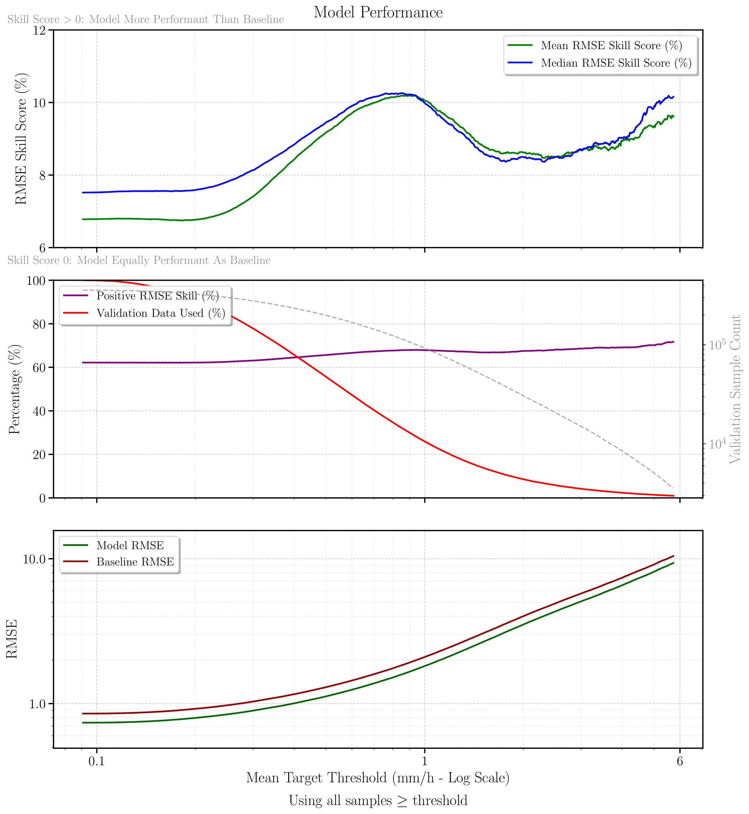

# Precipitation Nowcasting with Deep Learning

A deep learning project for short-term precipitation forecasting using ConvNeXt U-Net architecture with PyTorch Lightning. The project focuses on predicting precipitation patterns using radar data (RADOLAN) and digital elevation models (DEM).

## Preliminary Results

<p align="center">
  
</p>

Our ConvNeXt U-Net model demonstrates consistent improvements over the optical flow baseline across different precipitation intensities. These results were achieved after training for **just one epoch** on a 2-year dataset (2019-2020) with a daily-based train (70%) - validation (15%) - test (15%) split. The RMSE Skill Score analysis on validation data shows:

- **Consistent outperformance**: The model achieves positive skill scores of **~10%** across all precipitation thresholds, indicating superior performance compared to the baseline
- **Peak performance**: Maximum skill improvement (~10%) occurs around moderate precipitation intensities (1-2 mm/h)
- **Robust across intensities**: The model maintains skill advantages from light drizzle (0.1 mm/h) to heavy precipitation (6+ mm/h)
- **Statistical significance**: Results are based on extensive validation data with sample sizes ranging from ~10⁴ to ~10⁵ depending on precipitation threshold

*Note: These results demonstrate the model's effectiveness after minimal training. This analysis focuses on RMSE-based performance metrics. Comprehensive evaluation including FSS, CSI, and other meteorological skill scores will be presented in future work.*

## Features

- **ConvNeXt U-Net Architecture**: Modern CNN architecture for precipitation nowcasting
- **Multi-Modal Input**: Combines radar precipitation data with digital elevation models, further inputs can easily be added
- **Advanced Loss Functions**: Support for cross-entropy loss
- **Comprehensive Evaluation**: FSS (Fractions Skill Score), DLBD, and categorical metrics
- **Data Preprocessing Pipeline**: Efficient data loading with caching support
- **Multiple Execution Modes**: Debug, local, and cluster deployment options
- **Baseline Comparison**: Optical flow baseline for performance evaluation

## Project Structure

```
├── configs/                    # Configuration files
│   ├── cluster_default.yml    # Default cluster configuration
│   ├── local_config.yml       # Local machine overrides
│   └── debug_config.yml       # Debug mode settings
├── data_pre_processing/        # Data loading and preprocessing
├── model/                      # Neural network models and training logic
├── evaluation/                 # Evaluation metrics and pipelines
├── plotting/                   # Visualization and plotting utilities
├── helper/                     # Utility functions
├── training_utils/             # Training and preprocessing utilities
├── requirements/               # Environment setup files
└── train_lightning.py          # Main training script
```

## Environment Setup

### Prerequisites
- Python 3.10
- Conda or Mamba package manager
- CUDA-compatible GPU (recommended)

### Installation

1. **Create and activate the conda environment:**
```bash
# Create environment with Python 3.10
mamba create -n first_CNN_on_Radolan python=3.10 -y

# Activate the environment
mamba activate first_CNN_on_Radolan
```

2. **Configure conda channels:**
```bash
# Configure to use conda-forge with strict priority
conda config --env --add channels conda-forge
conda config --env --set channel_priority strict
```

3. **Install dependencies from conda-forge:**
```bash
mamba install -y pytorch-lightning xarray zarr numpy matplotlib pandas scipy dask pyarrow psutil h5py pyyaml einops pysteps wandb hurry.filesize
```

4. **Install PyTorch with CUDA support:**
```bash
# For CUDA 12.8 (nightly)
pip3 install --pre torch torchvision torchaudio --index-url https://download.pytorch.org/whl/nightly/cu128

# Alternatively, for CUDA 12.6
pip3 install torch torchvision torchaudio --index-url https://download.pytorch.org/whl/cu126
```

### Adding Additional Packages
When installing additional packages, always use mamba to preserve compatibility:
```bash
mamba install -y package-name
```

## Usage

The project supports three execution modes, each with its own configuration:

### 1. Debug Mode
For quick testing and development with minimal data and resources.

```bash
python train_lightning.py --mode debug
```

**Debug mode characteristics:**
- Uses very small datasets (5-minute time spans)
- Small batch sizes (batch_size=4) 
- Minimal epochs (max_epochs=1)
- 0 data loader workers (for debugging)
- Small input dimensions
- Fast execution for testing code changes

### 2. Local Mode  
For running on local machines with moderate datasets.

```bash
python train_lightning.py --mode local
```

**Local mode characteristics:**
- Uses larger datasets (10-day time spans)
- Moderate batch sizes (batch_size=64)
- Single GPU usage
- More realistic training scenarios
- Suitable for development and small experiments

### 3. Cluster Mode
For full-scale training on computing clusters.

```bash
python train_lightning.py --mode cluster
```

**Cluster mode characteristics:**
- Uses full datasets (2-year time spans) 
- Large batch sizes (batch_size=128)
- Multi-GPU support (4 GPUs)
- Extensive evaluation metrics
- Production-level training

## Configuration

Each mode loads settings from YAML configuration files in the `configs/` directory:

- `cluster_default.yml`: Base configuration with all default settings
- `local_config.yml`: Overrides for local machine execution  
- `debug_config.yml`: Overrides for debugging and testing

### Key Configuration Options

**Data Settings:**
```yaml
s_folder_path: "/path/to/radolan/data"
s_data_file_name: "RV_recalc_rechunked.zarr"
s_dem_path: "/path/to/dem/data.zarr"
s_crop_data_time_span: ["2019-01-01T00:00", "2020-12-01T00:00"]
```

**Model Settings:**
```yaml
s_convnext: true  # Use ConvNeXt architecture
s_input_height_width: 256
s_target_height_width: 32
s_num_input_time_steps: 4
s_num_lead_time_steps: 3
```

**Training Settings:**
```yaml
s_max_epochs: 100
s_batch_size: 128
s_learning_rate: 0.001
s_lr_schedule: true
```

**Evaluation Settings:**
```yaml
s_fss: true  # Enable FSS evaluation
s_fss_scales: [5, 11]
s_fss_thresholds: [0.78, 1.51, 3.53, 7.07, 12.14]
s_dlbd_eval: true  # Enable DLBD evaluation
```

## Data Requirements

The project expects data in zarr format:

1. **RADOLAN precipitation data**: Rechunked zarr files with precipitation measurements
2. **Digital Elevation Model (DEM)**: Static elevation data
3. **Baseline data**: Optical flow extrapolation baseline (optional)

Data should be organized with the following structure:
- Time dimension for temporal sequences
- Spatial dimensions (y, x) for geographic coordinates  
- Proper coordinate reference system metadata

## Plotting and Evaluation

### Plotting Only Mode
To run evaluation and plotting on existing model checkpoints:

```yaml
s_plotting_only: true
s_plot_sim_name: "Run_20250509-182459_ID_15005832_years_xentropy"
```

### Available Plots
- Training/validation loss curves
- Mean precipitation predictions vs targets
- Learning rate scheduling
- Evaluation metric comparisons

### Evaluation Metrics
- **RMSE**: Root mean square error
- **FSS**: Fractions Skill Score at multiple scales and thresholds
- **DLBD**: Distance-based evaluation with Gaussian smoothing
- **Categorical Metrics**: CSI and accuracy for precipitation thresholds

## Output Structure

Results are saved in the specified save directory with the following structure:
```
results/
└── Run_YYYYMMDD-HHMMSS_[suffix]/
    ├── model/              # Model checkpoints
    ├── logs/               # Training logs and metrics
    ├── plots/              # Generated plots
    ├── data/               # Preprocessed data cache
    ├── code/               # Code snapshot
    └── predictions/        # Model predictions (zarr)
```

## Memory and Performance

- **Data Preprocessing**: Uses efficient zarr chunking and dask for large datasets
- **Caching**: Preprocessed data is cached to avoid reprocessing
- **Multi-GPU**: Supports distributed training on multiple GPUs
- **Memory Management**: Configurable batch sizes and data loader workers

## Troubleshooting

**CUDA Issues:**
- Ensure CUDA_VISIBLE_DEVICES is set correctly
- Check PyTorch CUDA compatibility with your system

**Memory Issues:**
- Reduce batch size in configuration
- Decrease number of data loader workers
- Use smaller crop time spans for debugging

**Data Loading:**
- Verify zarr file paths and structure
- Check coordinate reference systems match
- Ensure proper chunking for your data size